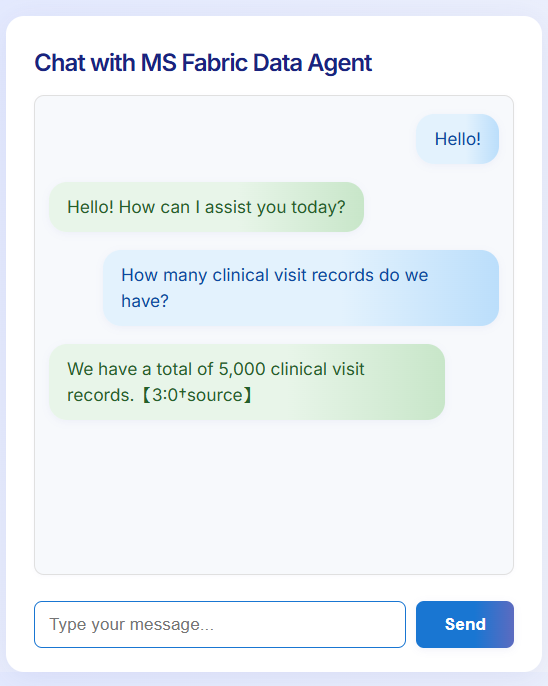
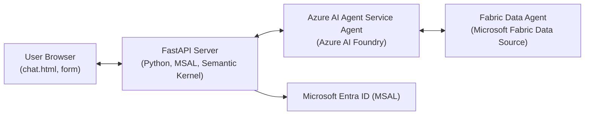

# Chat with MS Fabric Data Agent




*Modern chat UI with Entra ID login and Azure AI integration*

> **Update (June 2025):**
> - The app is now fully stateless. **No Redis or caching server is required or used.**
> - All chat state is handled per-request; the backend does not persist or cache chat data.
> - Documentation, setup, and troubleshooting have been updated to reflect this change.


Here's a simple, secure chat application that demonstrates how to:

- Authenticate users with Microsoft Entra ID (MSAL) in a FastAPI web app
- Connect to an Azure AI Agent Service agent (deployed in Azure AI Foundry)
- Use a Fabric Data Agent as a knowledge source for natural language queries
- Integrate Microsoft Fabric data with conversational AI using the Semantic Kernel
- Build a professional, cloud-ready Python app following Azure and open-source best practices


**Stateless:** No Redis or caching server is required. The backend does not store chat state. Each chat request is processed independently.

This project is ideal for developers and architects looking to:

- Learn how to combine Entra ID authentication, Azure AI Agent Service, and Microsoft Fabric
- See a real-world example of secure, scalable, and maintainable cloud app architecture
- Use environment-based configuration and modern Python web development patterns

---


## 🚀 Features

- 🔐 Microsoft Entra ID (MSAL) authentication
- 🤖 Azure AI Agent Service integration
- 📊 Fabric Data Agent as knowledge source
- 🧠 Semantic Kernel plugin
- 💬 Simple chat UI
- 🔒 Secure session management
- 📝 Easy configuration via `.env`
- 🟢 **Stateless backend** – no Redis or caching required

---

## 🏗️ Architecture



```
  +-------------------+         +-------------------+         +-------------------------------+         +--------------------------+
  |   User Browser    | <-----> |   FastAPI Server  | <-----> | Azure AI Agent Service Agent  | <-----> | Fabric Data Agent        |
  | (chat.html, form) |         |  (Python, MSAL,   |         |  (Azure AI Foundry,           |         | (Microsoft Fabric Data   |
  +-------------------+         |  Semantic Kernel) |         |   AgentsClient)               |         |  Source)                 |
                                +-------------------+         +-------------------------------+         +--------------------------+
                                         ^
                                         |
                                +--------------------------+
                                |   Microsoft Entra ID     |
                                |   (MSAL)                |
                                +--------------------------+
```


**Flow:**
1. User logs in via Microsoft Entra ID (MSAL) in the browser.
2. User sends a chat message to the FastAPI server.
3. FastAPI server uses the user's access token to call the Azure AI Agent Service agent (in Azure AI Foundry).
4. The Azure AI Agent Service agent uses a Fabric Data Agent as a knowledge source to answer the query.
5. The response is returned to the user in the chat UI.


**Stateless:** No chat history or state is stored on the backend. Each request is processed independently. Redis or any caching server is NOT required. You do **not** need to set up or run Redis for any feature.

---

## 🛠️ Setup

```bash
# 1. Clone the repo
git clone https://github.com/aliasgarjh/fabric-data-agent-app.git
cd fabric-data-agent-app

# 2. (Recommended) Create and activate a Python virtual environment
python -m venv .venv
# On Windows:
.venv\Scripts\activate
# On macOS/Linux:
source .venv/bin/activate

# 3. Copy and edit .env.example
cp .env.example .env

# 4. Install dependencies
pip install -r requirements.txt

 # 5. Run the app
 python -m uvicorn fastapi_fabric_chat:app --reload
```

---

## 📁 File Structure

- `fastapi_fabric_chat.py` — Main FastAPI app
- `static/chat.html` — Chat UI template
- `.env` — Configuration (secrets, endpoints, etc.)
- `.env.example` — Example environment file
- `requirements.txt` — Python dependencies
- `README.md` — Project documentation
- `LICENSE` — MIT License

---

## ⚙️ Configuration & Setup

### 1. Microsoft Entra ID App Registration (for Authentication)

1. Go to [Azure Portal > Microsoft Entra ID > App registrations](https://portal.azure.com/#blade/Microsoft_AAD_IAM/ActiveDirectoryMenuBlade/RegisteredApps).
2. Click **New registration**.
3. Enter a name (e.g., `Azure AI Fabric Chat`).
4. Set **Supported account types** as needed (usually "Accounts in this organizational directory only").
5. Set **Redirect URI** to:
   - Type: Web
   - Value: `http://localhost:8000/auth/redirect`
6. Click **Register**.
7. After registration, go to **Certificates & secrets** and create a **Client Secret**. Save the value for your `.env` file.
8. Go to **API permissions** and add the following **delegated** permissions (scopes):
   - Microsoft Graph:
     - `openid` (for authentication)
     - `profile` (to read user profile)
     - `email` (to read user email)
   - Azure Machine Learning Services:
     - `https://ai.azure.com/.default` (for Azure AI Agent Service access)
   - Any other required permissions for your scenario
9. Click **Grant admin consent** for your tenant.
10. Copy the **Application (client) ID** and **Directory (tenant) ID** for your `.env` file.

### 2. Azure AI Agent Service Agent Setup (in Azure AI Foundry)

You can add a Microsoft Fabric Data Agent as a knowledge source to your Azure AI Agent either through the Azure AI Foundry portal (UI) or programmatically. Below are the recommended UI steps:

1. Go to [Azure AI Foundry](https://ai.azure.com/) and select your Azure subscription and resource group.
2. In the left pane, under **Build and Customize**, select **Agents**.
3. Click **New Agent** to create a new agent, or select an existing agent to edit.
4. In the agent's setup pane, scroll to the **Knowledge** section and click **Add**.
5. In the menu of supported knowledge source types, select **Microsoft Fabric**.
6. If you have an existing connection to a Fabric Data Agent, select it. Otherwise, click **New Connection**.
7. In the connection dialog:
   - Enter the `workspace-id` and `artifact-id` from your published Fabric Data Agent endpoint. The endpoint format is:
     `https://fabric.microsoft.com/groups/<workspace_id>/aiskills/<artifact-id>`
   - Mark both as **Is Secret**.
   - Assign a name to your connection.
   - Click **Connect**.
8. The Microsoft Fabric Data Agent will now appear as a **Knowledge** resource for your agent.
9. (Optional) Update your agent's instructions to describe when and how to use the Fabric tool (e.g., "For customer and product sales data, use the Fabric tool").
10. Save your agent and test it using the **Try in playground** feature.

For more details and screenshots, see the [official Microsoft documentation](https://learn.microsoft.com/en-us/azure/ai-foundry/agents/how-to/tools/fabric#setup).


### 3. Environment Variables

Fill in your `.env` file with the following:

```
CLIENT_ID=<your-app-client-id>
CLIENT_SECRET=<your-app-client-secret>
TENANT_ID=<your-tenant-id>
FABRIC_PROJECT_ENDPOINT=<your-agent-project-endpoint>
FABRIC_AGENT_ID=<your-agent-id>
SESSION_SECRET=<your-random-session-secret>
```


**Note:** Redis or any caching server is NOT required. The app is fully stateless. You can ignore any previous instructions or configuration related to Redis.

---


## 🧑‍💻 Contributing

Contributions are welcome! Please see [CONTRIBUTING.md](CONTRIBUTING.md) for guidelines.

---

## 📫 Contact

- **Author:** Ali Asgar Juzer
- **GitHub:** [aliasgarjh](https://github.com/aliasgarjh)
- **Email:** ali.juzer@microsoft.com

---

## Best Practices

- Use Managed Identity or Service Principal for Azure authentication in production.
- Never hardcode credentials; use Key Vault or environment variables.
- Implement retry logic and error handling for all Azure SDK/API calls.
- Use HTTPS endpoints and enable encryption.
- Restrict API permissions to the minimum required.
- Use logging for all errors and important events.
- Regularly review and rotate secrets.
- Use Infrastructure as Code (Bicep, Terraform) for Azure deployments.

---


## Troubleshooting

- **State mismatch or session errors:** Ensure your `SESSION_SECRET` is set and consistent across restarts.
- **Authentication issues:** Double-check your Entra ID app registration, redirect URI, and tenant settings.
- **Fabric/AI Agent errors:** Verify your endpoint and agent IDs, and that your user has access.
- **No Redis needed:** The app is fully stateless and does not require Redis or any caching server. If you see any references to Redis in old documentation or code, you can ignore them.

---

## License
MIT License
